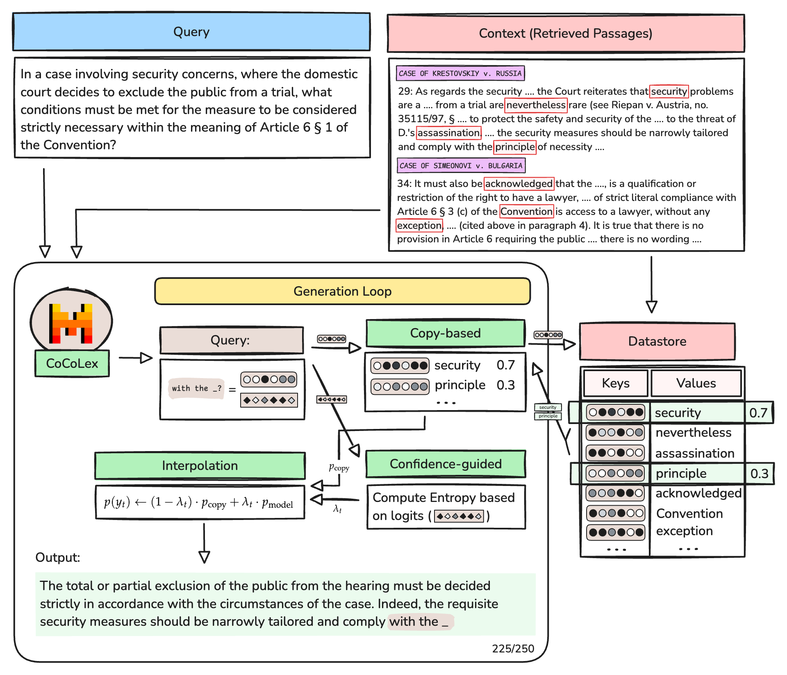

# Master Thesis Experiments Repository

Welcome to the repository for hosting experiments for the Master Thesis at the Technical University of Munich (TUM) in Legal Tech.

## Overview

This repository contains all the code, data, and documentation related to the experiments conducted as part of the Master Thesis in Legal Tech. The experiments aim to explore and develop innovative solutions at the intersection of law and technology.

